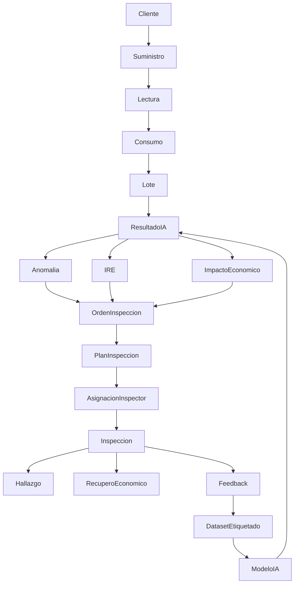

1. Introducción

2. Objetivos

3. Ubiquitous Language

4. Bounded Contexts

5. Modelo del Dominio

6. Entidades

7. Value Objects

8. Aggregates

9. Domain Services

10. Domain Events

11. Reglas del Negocio

12. Estados

13. Diagramas

14. Relación con la Base de Datos

15. Conclusiones


# 1. Introducción

## 1.1 Propósito

El presente documento describe el modelo de dominio del proyecto **EnergIA**, utilizando los principios de **Domain-Driven Design (DDD)**.

Su objetivo es representar los conceptos del negocio, las reglas que los gobiernan y las relaciones existentes entre ellos, independientemente de la tecnología utilizada para su implementación.

Este documento constituye la base para el diseño de:

- Base de datos.
- API REST.
- Casos de uso.
- Motor de Inteligencia Energética.
- Arquitectura Clean Architecture.

---

## 1.2 Objetivos

El modelo de dominio busca:

- Representar fielmente el negocio de una distribuidora eléctrica.
- Centralizar las reglas del negocio.
- Minimizar el acoplamiento entre componentes.
- Facilitar la evolución del sistema.
- Servir como referencia para el desarrollo del backend y frontend.

---

## 1.3 Alcance

El dominio contempla el análisis de consumos históricos de energía eléctrica para detectar comportamientos anómalos mediante Inteligencia Artificial y generar un ranking inteligente de inspecciones.

El modelo no contempla procesos de facturación, cobranzas, atención al cliente ni gestión comercial, ya que esos procesos pertenecen a otros dominios del negocio.

---

# 2. Principios del Modelo

El dominio se diseñará siguiendo los siguientes principios.

- Domain Driven Design (DDD)
- Clean Architecture
- SOLID
- Alta cohesión
- Bajo acoplamiento
- Persistencia ignorante (Persistence Ignorance)

Las reglas del negocio nunca dependerán de frameworks, motores de bases de datos ni librerías externas.

---

# 3. Ubiquitous Language

Todos los integrantes del proyecto deberán utilizar un lenguaje común.

| Término | Definición |
|----------|------------|
| Cliente | Persona física o jurídica titular de uno o más suministros eléctricos. |
| Suministro | Punto de suministro identificado por un número único donde se registra el consumo de energía. Es la entidad principal del dominio. |
| Categoría Tarifaria | Clasificación comercial del suministro (Residencial, Comercial, Industrial, etc.). |
| Consumo | Energía registrada durante un período de facturación, expresada en kWh. |
| Lectura | Valor del medidor utilizado para calcular el consumo del período. |
| Lote de Facturación | Conjunto de suministros procesados en una misma ejecución de facturación. |
| Anomalía | Comportamiento de consumo considerado atípico por el Motor de IA. |
| Índice de Riesgo Energético (IRE) | Puntaje de 0 a 100 que representa la prioridad de inspección de un suministro. |
| Impacto Económico Estimado (IEE) | Estimación monetaria de la pérdida potencial para la distribuidora asociada a una anomalía. |
| Inspección | Actividad realizada por personal técnico para verificar una anomalía detectada. |
| Orden de Inspección | Documento generado por el sistema para planificar una inspección. |
| Feature | Variable derivada utilizada por el modelo de IA para realizar predicciones. |
| Modelo IA | Algoritmo de Machine Learning encargado de detectar anomalías en los consumos. |

---

# 4. Bounded Contexts

El dominio se divide en varios contextos claramente definidos.

## 4.1 Gestión de Clientes

Responsable de administrar la información básica de los clientes.

### Entidades

- Cliente

---

## 4.2 Gestión de Suministros

Representa los puntos de suministro eléctrico.

### Entidades

- Suministro
- Categoría Tarifaria

---

## 4.3 Gestión de Consumos

Representa el historial de consumos y lecturas.

### Entidades

- Lectura
- Consumo
- Lote de Facturación

---

## 4.4 Motor de Inteligencia Energética

Analiza los consumos y determina anomalías.

### Entidades

- Resultado IA
- Anomalía
- Feature

---

## 4.5 Gestión del Riesgo

Calcula el Índice de Riesgo Energético y el Impacto Económico Estimado.

### Entidades

- IRE
- IEE

---

## 4.6 Gestión de Inspecciones

Administra la planificación y seguimiento de inspecciones.

### Entidades

- Orden de Inspección
- Resultado de Inspección

---

## 4.7 Dashboard Ejecutivo

Contexto encargado exclusivamente de consultas y visualización de indicadores.

No contiene reglas de negocio.

---

# 5. Visión General del Dominio

El núcleo del sistema está centrado en el **Suministro**.

A partir del historial de consumos de cada suministro, el sistema ejecuta un proceso de análisis inteligente que identifica comportamientos anómalos, estima su impacto económico y prioriza las inspecciones técnicas.

```text
Cliente
   │
   └──────────────┐
                  │
             Suministro
                  │
         ┌────────┴────────┐
         │                 │
     Lecturas         Consumos
                            │
                            ▼
                 Motor de Inteligencia Energética
                            │
                ┌───────────┴───────────┐
                │                       │
          Anomalía                 Resultado IA
                │
                ▼
        Índice de Riesgo (IRE)
                │
                ▼
 Impacto Económico Estimado (IEE)
                │
                ▼
      Orden de Inspección
                │
                ▼
    Resultado de Inspección
```

---

# 6. Conceptos Fundamentales

El dominio se apoya en tres pilares fundamentales:

### 1. Consumo histórico

Representa la información histórica utilizada para comprender el comportamiento energético de un suministro.

### 2. Inteligencia Artificial

Analiza automáticamente el comportamiento del suministro utilizando técnicas de Machine Learning no supervisado.

### 3. Gestión Inteligente de Inspecciones

Transforma los resultados obtenidos por el modelo de IA en acciones concretas mediante la generación y priorización de órdenes de inspección.

---

# Fin de la Parte 1

# 7. Entidades del Dominio

---

## 7.1 Cliente

### Descripción

Representa a la persona física o jurídica titular de uno o más suministros eléctricos.

El Cliente existe únicamente como propietario de suministros y no participa directamente del proceso de detección de anomalías.

---

### Responsabilidades

- Mantener los datos identificatorios.
- Relacionarse con uno o varios suministros.
- Permitir segmentaciones estadísticas.

---

### Atributos

| Atributo | Tipo | Descripción |
|----------|------|-------------|
| id | UUID | Identificador único |
| numeroCliente | String | Número de cliente |
| nombre | String | Nombre o razón social |
| documento | String | DNI/CUIT |
| localidad | String | Localidad |
| barrio | String | Barrio |
| direccion | String | Domicilio |
| estado | Enum | Activo / Inactivo |

---

### Reglas del Negocio

Las reglas identificadas como RD-xxx en este documento son invariantes de dominio locales a este modelo. Las reglas de negocio (RN-xxx) se definen de forma canónica en `docs/01-business/BUSINESS_ANALYSIS.md`, sección 15.

RD-001

Un cliente puede poseer múltiples suministros. (implementa RN-002)

RD-002

Todo suministro debe pertenecer a un único cliente. (implementa RN-001)

RD-003

Un cliente inactivo mantiene su historial.

---

### Relaciones

Cliente

↓

1..N

↓

Suministro

---

### Métodos del Dominio

registrar()

actualizar()

desactivar()

obtenerSuministros()

---

## 7.2 Suministro

### Descripción

El Suministro representa el punto físico donde se entrega energía eléctrica.

Es la entidad central del dominio.

Todas las operaciones inteligentes del sistema se realizan sobre un suministro.

---

### Responsabilidades

- Mantener el historial energético.
- Asociarse a una categoría tarifaria.
- Calcular indicadores.
- Ser evaluado por IA.

---

### Atributos

| Atributo | Tipo |
|----------|------|
| id | UUID |
| numeroSuministro | String |
| clienteId | UUID |
| categoriaTarifaria | Enum |
| localidad | String |
| barrio | String |
| fechaAlta | Date |
| estado | Enum |

---

### Reglas del Negocio

RD-004

Un suministro posee múltiples consumos.

RD-005

Todo suministro pertenece a una única categoría tarifaria. (implementa RN-003)

RD-006

No puede existir un suministro sin cliente. (implementa RN-001)

RD-007

El historial nunca puede eliminarse.

---

### Relaciones

Suministro

↓

Lecturas

↓

Consumos

↓

Anomalías

↓

Inspecciones

---

### Métodos del Dominio

registrarLectura()

registrarConsumo()

obtenerHistorial()

calcularPromedio()

calcularVariacion()

obtenerUltimaAnomalia()

---

## 7.3 Categoría Tarifaria

### Descripción

Clasifica comercialmente un suministro.

Esta clasificación será utilizada por el Motor de Inteligencia Energética para comparar suministros similares.

---

### Ejemplos

Residencial

Comercial

Industrial

Grandes Demandas

Alumbrado Público

---

### Responsabilidades

- Clasificar suministros.
- Permitir segmentación del modelo IA.

---

### Reglas

RD-008

Todo suministro debe pertenecer a una categoría. (implementa RN-003)

RD-009

La IA solo compara suministros de categorías equivalentes.

---

## 7.4 Lote de Facturación

### Descripción

Representa un conjunto de consumos importados en una misma ejecución.

No representa la facturación comercial.

Representa únicamente la unidad de procesamiento del sistema EnergIA.

---

### Responsabilidades

- Agrupar consumos.
- Iniciar procesamiento IA.
- Permitir trazabilidad.

---

### Atributos

| Campo | Tipo |
|--------|------|
| id | UUID |
| nombre | String |
| fechaImportacion | DateTime |
| cantidadRegistros | Integer |
| estado | Enum |

---

### Estados

Pendiente

Procesando

Procesado

Error

---

### Reglas

RD-010

Un lote no puede ejecutarse dos veces.

RD-011

Un lote debe finalizar antes de iniciar otro.

RD-012

Todo consumo pertenece a un lote.

---

### Métodos

importar()

procesar()

finalizar()

cancelar()

---

## 7.5 Lectura

### Descripción

Representa una lectura real del medidor.

Es el origen de los consumos históricos.

---

### Responsabilidades

- Registrar valores del medidor.
- Calcular consumos.

---

### Atributos

| Campo | Tipo |
|--------|------|
| id | UUID |
| suministroId | UUID |
| fechaLectura | Date |
| lecturaAnterior | Decimal |
| lecturaActual | Decimal |
| diasFacturados | Integer |

---

### Reglas

RD-013

La lectura actual debe ser mayor o igual que la anterior.

RD-014

Los días facturados deben ser mayores que cero.

RD-015

Una lectura pertenece a un único suministro.

---

### Métodos

validar()

calcularConsumo()

---

## 7.6 Consumo

### Descripción

Representa el consumo energético correspondiente a un período de facturación.

Es la principal fuente de información para el modelo de Inteligencia Artificial.

---

### Responsabilidades

- Registrar el consumo histórico.
- Servir como entrada para IA.
- Calcular indicadores.

---

### Atributos

| Campo | Tipo |
|--------|------|
| id | UUID |
| suministroId | UUID |
| loteId | UUID |
| fechaInicio | Date |
| fechaFin | Date |
| diasFacturados | Integer |
| kwh | Decimal |
| consumoPromedioDiario | Decimal |

---

### Reglas

RD-016

El consumo debe ser mayor o igual a cero.

RD-017

El período no puede superponerse con otro.

RD-018

Debe existir una lectura asociada.

RD-019

Todo consumo pertenece a un lote.

---

### Métodos del Dominio

calcularPromedioDiario()

calcularVariacion()

obtenerPeriodoAnterior()

obtenerConsumosHistoricos()

esConsumoAtipico()

---

# Relación General de las Entidades

Cliente (1)

↓

Suministro (N)

↓

Lecturas (N)

↓

Consumos (N)

↓

LoteFacturación (1)

---

# Aggregate Root

En esta primera etapa del dominio se define como Aggregate Root principal a:

Suministro

Todas las operaciones relacionadas con consumos, anomalías e inspecciones deberán iniciarse desde esta entidad para garantizar la consistencia del dominio.

---

# Fin Parte 2

# 8. Dominio de Inteligencia Artificial

El contexto de Inteligencia Artificial es el núcleo del sistema EnergIA.

Su objetivo es analizar automáticamente el comportamiento histórico de los suministros para detectar patrones anómalos, estimar el riesgo asociado y recomendar acciones de inspección.

El Motor de Inteligencia Energética nunca modifica datos operativos.

Su función consiste en generar conocimiento para asistir la toma de decisiones.

---

# 8.1 ResultadoIA

## Descripción

Representa el resultado completo generado por el Motor de Inteligencia Energética para un suministro durante el procesamiento de un lote.

Cada ejecución del modelo genera exactamente un ResultadoIA por suministro analizado.

---

## Responsabilidades

- Registrar el resultado del modelo.
- Asociar la versión del modelo utilizada.
- Mantener trazabilidad.
- Calcular el Índice de Riesgo Energético.
- Estimar el Impacto Económico.
- Asociar las anomalías detectadas.

---

## Atributos

| Campo | Tipo |
|--------|------|
| id | UUID |
| suministroId | UUID |
| loteId | UUID |
| modeloIAId | UUID |
| fechaAnalisis | DateTime |
| scoreAnomalia | Decimal |
| probabilidad | Decimal |
| clasificacion | Enum |
| observaciones | String |

---

## Clasificaciones

Normal

Atención

Alto Riesgo

Crítico

---

## Reglas del Negocio

RD-020

Todo ResultadoIA pertenece a un único suministro.

RD-021

Todo ResultadoIA pertenece a un único lote.

RD-022

Debe registrarse la versión del modelo utilizada.

RD-023

No puede existir más de un ResultadoIA por suministro y lote.

---

## Métodos

calcularIRE()

calcularImpactoEconomico()

clasificar()

generarExplicacion()

---

# 8.2 Anomalía

## Descripción

Representa un comportamiento considerado atípico por el modelo de Inteligencia Artificial.

Una anomalía no implica necesariamente fraude.

Representa únicamente una condición que requiere revisión.

---

## Responsabilidades

- Registrar eventos anómalos.
- Mantener historial.
- Asociar evidencia.
- Servir como base para inspecciones.

---

## Atributos

| Campo | Tipo |
|--------|------|
| id | UUID |
| resultadoIAId | UUID |
| tipo | Enum |
| severidad | Enum |
| descripcion | String |
| fechaDeteccion | DateTime |

---

## Tipos

Consumo Muy Bajo

Consumo Muy Alto

Caída Brusca

Incremento Brusco

Patrón Irregular

Persistencia Anómala

Desvío Estadístico

---

## Severidad

Baja

Media

Alta

Crítica

---

## Reglas

RD-024

Toda anomalía pertenece a un ResultadoIA.

RD-025

Una anomalía nunca representa automáticamente fraude. (implementa RN-008)

RD-026

Debe existir evidencia histórica.

---

## Métodos

registrar()

actualizarSeveridad()

cerrar()

---

# 8.3 Índice de Riesgo Energético (IRE)

## Descripción

El IRE representa un puntaje calculado entre 0 y 100 que indica la prioridad de inspección de un suministro.

No depende únicamente del modelo IA.

Integra múltiples factores del negocio.

---

## Objetivos

Priorizar inspecciones.

Reducir pérdidas.

Optimizar recursos.

Maximizar recupero económico.

---

## Atributos

| Campo | Tipo |
|--------|------|
| id | UUID |
| resultadoIAId | UUID |
| valor | Decimal |
| fechaCalculo | DateTime |

---

## Escala

0 - 20

Muy Bajo

21 - 40

Bajo

41 - 60

Medio

61 - 80

Alto

81 - 100

Crítico

---

## Factores considerados

Score del modelo IA

Historial de consumos

Persistencia de anomalías

Variación porcentual

Consumo promedio

Categoría tarifaria

Impacto económico estimado

Resultado de inspecciones anteriores

---

## Métodos

calcular()

actualizar()

clasificar()

---

# 8.4 Impacto Económico Estimado (IEE)

## Descripción

Representa la estimación económica de la posible pérdida para la distribuidora asociada a una anomalía.

Este indicador será utilizado por la Gerencia para priorizar inspecciones.

---

## Responsabilidades

Estimar recupero potencial.

Priorizar recursos.

Generar indicadores ejecutivos.

---

## Atributos

| Campo | Tipo |
|--------|------|
| id | UUID |
| resultadoIAId | UUID |
| montoEstimado | Decimal |
| moneda | String |
| fechaCalculo | DateTime |

---

## Reglas

RD-027

El monto nunca puede ser negativo.

RD-028

Toda estimación debe ser reproducible.

RD-029

Debe conservarse el histórico.

---

## Métodos

estimar()

recalcular()

actualizar()

---

# 8.5 Feature Vector

## Descripción

Representa el conjunto de variables utilizadas por el modelo IA para evaluar un suministro.

No forma parte del negocio comercial.

Forma parte exclusivamente del dominio analítico.

---

## Ejemplos de Features

Consumo promedio

Consumo máximo

Consumo mínimo

Desvío estándar

Variación respecto del período anterior

Variación anual

Promedio móvil

Persistencia

Estacionalidad

Cantidad de anomalías históricas

Días facturados

Categoría tarifaria

---

## Responsabilidades

Agrupar variables.

Versionar variables.

Facilitar entrenamiento.

---

## Métodos

generar()

validar()

serializar()

---

# 8.6 Modelo IA

## Descripción

Representa el algoritmo entrenado utilizado para detectar anomalías.

---

## Responsabilidades

Mantener trazabilidad.

Versionar modelos.

Registrar métricas.

---

## Atributos

| Campo | Tipo |
|--------|------|
| id | UUID |
| nombre | String |
| versión | String |
| algoritmo | Enum |
| fechaEntrenamiento | Date |
| precisión | Decimal |
| recall | Decimal |
| f1Score | Decimal |

---

## Algoritmos soportados

Isolation Forest

Local Outlier Factor

One Class SVM

Autoencoder (futuro)

---

## Métodos

entrenar()

evaluar()

predecir()

versionar()

desactivar()

---

# 8.7 Predicción

## Descripción

Representa una ejecución específica del modelo IA.

---

## Responsabilidades

Registrar inferencias.

Mantener histórico.

Relacionar resultados.

---

## Atributos

| Campo | Tipo |
|--------|------|
| id | UUID |
| modeloIAId | UUID |
| suministroId | UUID |
| fechaPrediccion | DateTime |
| score | Decimal |
| clasificacion | Enum |

---

## Métodos

ejecutar()

persistir()

explicar()

---

# Relaciones del Dominio IA

Modelo IA

↓

Predicción

↓

Resultado IA

↓

Anomalía

↓

IRE

↓

Impacto Económico

↓

Orden de Inspección

---

# Aggregate Root

En el contexto de Inteligencia Artificial el Aggregate Root será:

ResultadoIA

Todas las entidades del dominio analítico dependerán de esta entidad para garantizar consistencia.

---

# Objetivo Estratégico

El dominio de Inteligencia Artificial tiene como finalidad transformar grandes volúmenes de datos históricos en información accionable que permita:

- Detectar consumos anómalos.
- Priorizar inspecciones.
- Optimizar recursos operativos.
- Reducir pérdidas no técnicas.
- Proveer indicadores para la toma de decisiones gerenciales.

---

# Fin Parte 3

# 9. Dominio de Gestión Inteligente de Inspecciones

El dominio de Gestión Inteligente de Inspecciones tiene como objetivo transformar los resultados obtenidos por el Motor de Inteligencia Energética en acciones concretas para el personal operativo.

Este dominio representa el puente entre el análisis inteligente y la operación diaria de la empresa.

Su finalidad es optimizar la utilización de los recursos de inspección, priorizando aquellos suministros con mayor probabilidad de representar pérdidas económicas para la distribuidora.

---

# 9.1 Orden de Inspección

## Descripción

Representa una orden generada automáticamente por EnergIA para inspeccionar un suministro cuyo comportamiento fue clasificado como anómalo.

La generación de una orden no implica que exista fraude.

Representa únicamente una recomendación basada en evidencia estadística y reglas de negocio.

---

## Responsabilidades

- Registrar la inspección.
- Mantener su estado.
- Asociar un suministro.
- Asociar un IRE.
- Asociar un IEE.
- Mantener trazabilidad.

---

## Atributos

| Campo | Tipo |
|--------|------|
| id | UUID |
| numeroOrden | String |
| suministroId | UUID |
| resultadoIAId | UUID |
| prioridad | Enum |
| fechaGeneracion | DateTime |
| fechaProgramada | Date |
| estado | Enum |
| observaciones | String |

---

## Prioridades

Muy Baja

Baja

Media

Alta

Crítica

---

## Estados

Generada

Pendiente

Asignada

En Proceso

Finalizada

Cancelada

---

## Reglas del Negocio

RD-030

Toda orden debe estar asociada a un suministro.

RD-031

Toda orden debe estar asociada a un Resultado IA.

RD-032

Una orden finalizada no puede volver a estado pendiente.

RD-033

No pueden existir dos órdenes activas para el mismo suministro.

---

## Métodos

generar()

asignar()

cancelar()

finalizar()

cambiarPrioridad()

---

# 9.2 Plan de Inspección

## Descripción

Representa la planificación diaria o periódica de inspecciones.

Agrupa múltiples órdenes para optimizar los recorridos.

---

## Responsabilidades

- Agrupar órdenes.
- Optimizar recorridos.
- Reducir tiempos de traslado.
- Balancear carga de trabajo.

---

## Atributos

| Campo | Tipo |
|--------|------|
| id | UUID |
| fecha | Date |
| localidad | String |
| barrio | String |
| cantidadOrdenes | Integer |
| estado | Enum |

---

## Reglas

RD-034

Las órdenes deben pertenecer preferentemente a la misma localidad.

RD-035

Se priorizarán agrupamientos por barrio.

RD-036

Las órdenes críticas siempre tendrán prioridad.

---

## Métodos

generar()

optimizar()

reasignar()

cerrar()

---

# 9.3 Asignación de Inspector

## Descripción

Representa la asignación de una orden a un inspector.

En una primera versión se integrará con el sistema de Recursos Humanos.

---

## Responsabilidades

- Asignar órdenes.
- Registrar fechas.
- Mantener historial.

---

## Atributos

| Campo | Tipo |
|--------|------|
| id | UUID |
| ordenId | UUID |
| inspectorId | UUID |
| fechaAsignacion | DateTime |
| estado | Enum |

---

## Estados

Pendiente

Aceptada

Rechazada

Finalizada

---

## Métodos

asignar()

aceptar()

rechazar()

finalizar()

---

# 9.4 Resultado de Inspección

## Descripción

Representa el resultado obtenido luego de realizar una inspección técnica.

Es una de las entidades más importantes del dominio porque permitirá mejorar continuamente el modelo de IA.

---

## Responsabilidades

- Registrar evidencia.
- Confirmar o descartar anomalías.
- Retroalimentar el modelo IA.

---

## Atributos

| Campo | Tipo |
|--------|------|
| id | UUID |
| ordenId | UUID |
| fecha | DateTime |
| resultado | Enum |
| observaciones | String |

---

## Resultados

Sin Novedad

Error de Medición

Medidor Defectuoso

Conexión Irregular

Fraude Confirmado

Normalizado

---

## Reglas

RD-037

Toda inspección debe tener un resultado. (implementa RN-010)

RD-038

El resultado es obligatorio. (implementa RN-010)

RD-039

Toda inspección debe cerrar una orden.

---

## Métodos

registrar()

actualizar()

cerrar()

---

# 9.5 Hallazgo

## Descripción

Representa el detalle técnico encontrado durante una inspección.

Permite registrar evidencia específica.

---

## Ejemplos

Medidor manipulado

Puente eléctrico

Conexión directa

Error en lectura

Medidor detenido

Transformador defectuoso

Error administrativo

---

## Responsabilidades

- Registrar evidencia.
- Clasificar hallazgos.
- Facilitar estadísticas.

---

## Atributos

| Campo | Tipo |
|--------|------|
| id | UUID |
| inspeccionId | UUID |
| tipo | Enum |
| descripcion | String |
| severidad | Enum |

---

## Métodos

registrar()

clasificar()

actualizar()

---

# 9.6 Recupero Económico

## Descripción

Representa el monto recuperado luego de una inspección exitosa.

Este indicador permitirá medir el retorno de inversión del sistema EnergIA.

---

## Responsabilidades

- Registrar recuperos.
- Calcular ROI.
- Generar indicadores gerenciales.

---

## Atributos

| Campo | Tipo |
|--------|------|
| id | UUID |
| inspeccionId | UUID |
| montoRecuperado | Decimal |
| fecha | Date |
| observaciones | String |

---

## Reglas

RD-040

El recupero nunca puede ser negativo.

RD-041

Solo puede registrarse si existe una inspección finalizada.

---

## Métodos

registrar()

actualizar()

---

# 9.7 Tarea RRHH

## Descripción

Representa la tarea enviada al Sistema de Recursos Humanos.

Permite integrar EnergIA con el sistema corporativo de gestión de tareas.

---

## Responsabilidades

- Crear tareas.
- Consultar estado.
- Sincronizar resultados.

---

## Estados

Pendiente

Asignada

En Curso

Finalizada

Cancelada

---

## Métodos

crear()

sincronizar()

consultarEstado()

cerrar()

---

# Flujo Operativo

Resultado IA

↓

Anomalía Detectada

↓

IRE

↓

IEE

↓

Orden de Inspección

↓

Plan de Inspección

↓

Asignación de Inspector

↓

Inspección

↓

Hallazgo

↓

Resultado

↓

Recupero Económico

↓

Retroalimentación del Modelo IA

---

# Aggregate Root

En el contexto de Gestión de Inspecciones el Aggregate Root será:

Orden de Inspección

Todas las operaciones relacionadas con planificación, asignación, ejecución y cierre deberán iniciarse desde esta entidad para garantizar la consistencia del dominio.

---

# Objetivos Estratégicos

El dominio de Gestión Inteligente de Inspecciones busca:

- Priorizar inspecciones según riesgo.
- Optimizar la utilización de recursos humanos.
- Reducir tiempos de traslado.
- Incrementar la tasa de detección de irregularidades.
- Maximizar el recupero económico.
- Retroalimentar continuamente el Motor de Inteligencia Energética mediante los resultados obtenidos en campo.

---

# Fin Parte 4

# 10. Aprendizaje Continuo (Continuous Learning)

## Descripción

El contexto de Aprendizaje Continuo tiene como objetivo mejorar progresivamente la precisión del Motor de Inteligencia Energética a partir de los resultados obtenidos durante las inspecciones realizadas por la empresa.

A diferencia de un modelo estático, EnergIA incorpora un mecanismo de retroalimentación (Feedback Loop) que permite utilizar la información obtenida en campo para enriquecer el conjunto de datos históricos y generar nuevas versiones del modelo predictivo.

Este proceso garantiza que el sistema evolucione junto con los cambios en los patrones de consumo de los usuarios.

---

# 10.1 Feedback del Modelo

## Descripción

Representa la información que retorna desde una inspección hacia el Motor de Inteligencia Energética.

Su función es indicar si la predicción realizada fue correcta o incorrecta.

---

## Responsabilidades

- Registrar el resultado real.
- Comparar predicción vs realidad.
- Generar datos etiquetados.
- Alimentar el proceso de reentrenamiento.

---

## Atributos

| Campo | Tipo |
|--------|------|
| id | UUID |
| resultadoIAId | UUID |
| inspeccionId | UUID |
| prediccionOriginal | Enum |
| resultadoReal | Enum |
| coincidencia | Boolean |
| fechaRegistro | DateTime |

---

## Reglas del Negocio

RD-042

Todo Feedback debe estar asociado a una inspección finalizada.

RD-043

Debe conservarse el resultado original del modelo.

RD-044

El feedback nunca modifica predicciones históricas.

---

## Métodos

registrar()

validar()

generarEtiqueta()

---

# 10.2 Dataset Etiquetado

## Descripción

Representa el conjunto de observaciones validadas por personal técnico.

Constituye la principal fuente para entrenamientos supervisados futuros.

---

## Responsabilidades

- Consolidar registros validados.
- Mantener calidad de datos.
- Servir como dataset de entrenamiento.

---

## Atributos

| Campo | Tipo |
|--------|------|
| id | UUID |
| suministroId | UUID |
| fecha | Date |
| etiqueta | Enum |
| origen | Enum |

---

## Etiquetas

Normal

Anomalía Confirmada

Fraude Confirmado

Error Administrativo

Medidor Defectuoso

Lectura Incorrecta

---

## Reglas

RD-045

Solo pueden incorporarse datos provenientes de inspecciones finalizadas. (implementa RN-011)

RD-046

Las etiquetas no pueden modificarse sin auditoría.

---

## Métodos

agregar()

validar()

exportar()

---

# 10.3 Reentrenamiento del Modelo

## Descripción

Representa el proceso mediante el cual se genera una nueva versión del modelo de Inteligencia Artificial utilizando información histórica y datos etiquetados.

Este proceso podrá ejecutarse de forma manual o programada.

---

## Responsabilidades

- Preparar datasets.
- Entrenar nuevas versiones.
- Comparar desempeño.
- Publicar nuevos modelos.

---

## Atributos

| Campo | Tipo |
|--------|------|
| id | UUID |
| modeloAnterior | UUID |
| modeloNuevo | UUID |
| fechaInicio | DateTime |
| fechaFin | DateTime |
| estado | Enum |

---

## Estados

Pendiente

Entrenando

Validando

Publicado

Cancelado

Error

---

## Reglas

RD-047

Nunca debe reemplazarse un modelo sin validación.

RD-048

Toda versión debe conservarse.

RD-049

Debe registrarse la configuración utilizada.

---

## Métodos

iniciar()

entrenar()

validar()

publicar()

cancelar()

---

# 10.4 Métricas del Modelo

## Descripción

Representa las métricas obtenidas durante la evaluación de un modelo.

Permite comparar versiones y seleccionar la más adecuada.

---

## Atributos

| Campo | Tipo |
|--------|------|
| precision | Decimal |
| recall | Decimal |
| f1Score | Decimal |
| rocAuc | Decimal |
| accuracy | Decimal |

---

## Responsabilidades

- Medir desempeño.
- Comparar modelos.
- Validar calidad.

---

## Métodos

calcular()

comparar()

generarReporte()

---

# 10.5 Versionado del Modelo

## Descripción

Representa cada versión publicada del Motor de IA.

El sistema conservará el historial completo para garantizar trazabilidad.

---

## Atributos

| Campo | Tipo |
|--------|------|
| id | UUID |
| versión | String |
| algoritmo | String |
| fechaPublicación | Date |
| estado | Enum |

---

## Estados

Activo

Obsoleto

Experimental

Retirado

---

## Métodos

activar()

desactivar()

comparar()

---

# Flujo de Aprendizaje Continuo

Resultado IA

↓

Orden de Inspección

↓

Inspección

↓

Resultado Real

↓

Feedback

↓

Dataset Etiquetado

↓

Entrenamiento

↓

Evaluación

↓

Nueva Versión del Modelo

↓

Producción

---

# Aggregate Root

En el contexto de Aprendizaje Continuo el Aggregate Root será:

ModeloIA

Toda nueva versión del modelo será gestionada desde esta entidad para mantener la consistencia del ciclo de vida del algoritmo.

---

# Objetivos Estratégicos

El contexto de Aprendizaje Continuo busca:

- Mejorar progresivamente la precisión del Motor de Inteligencia Energética.
- Reducir falsos positivos.
- Reducir falsos negativos.
- Adaptarse a nuevos patrones de consumo.
- Incorporar conocimiento generado por los inspectores.
- Garantizar trazabilidad completa del ciclo de vida del modelo.
- Implementar un proceso de mejora continua basado en evidencia.

---

# Beneficios para la Empresa

La incorporación del Aprendizaje Continuo permite que EnergIA deje de ser una herramienta estática y evolucione hacia una plataforma inteligente capaz de aprender de la experiencia operativa.

Esto incrementa la confiabilidad del sistema, mejora la asignación de recursos de inspección y aumenta el retorno de inversión mediante una detección cada vez más precisa de consumos anómalos.

---

# Fin Parte 5

# 11. Value Objects

## Descripción

Los Value Objects representan conceptos del dominio que no tienen identidad propia, pero sí un valor significativo dentro del sistema.

Son inmutables y se comparan por valor, no por identidad.

---

## 11.1 Dirección

Representa la ubicación física de un suministro o cliente.

### Atributos

| Campo | Tipo |
|------|------|
| calle | String |
| numero | String |
| barrio | String |
| localidad | String |
| provincia | String |
| codigoPostal | String |

---

## 11.2 Período de Consumo

Define el intervalo de tiempo en el que se mide el consumo.

### Atributos

| Campo | Tipo |
|------|------|
| fechaInicio | Date |
| fechaFin | Date |
| dias | Integer |

---

## 11.3 Rango de Consumo

Representa un intervalo esperado de consumo energético.

### Atributos

| Campo | Tipo |
|------|------|
| minimo | Decimal |
| maximo | Decimal |
| unidad | String |

---

## 11.4 Dinero

Representa un valor monetario.

### Atributos

| Campo | Tipo |
|------|------|
| monto | Decimal |
| moneda | String |

---

# 12. Domain Services

## Descripción

Los Domain Services encapsulan lógica de negocio que no pertenece naturalmente a una sola entidad.

---

## 12.1 Servicio de Cálculo de IRE

Calcula el Índice de Riesgo Energético.

### Responsabilidades

- Agregar variables del dominio.
- Normalizar valores.
- Calcular score final.

---

## 12.2 Servicio de Cálculo de Impacto Económico

### Responsabilidades

- Estimar pérdidas potenciales.
- Analizar consumos históricos.
- Aplicar reglas tarifarias.

---

## 12.3 Servicio de Detección de Anomalías

### Responsabilidades

- Ejecutar modelo IA.
- Interpretar resultados.
- Generar entidades Anomalía.

---

## 12.4 Servicio de Planificación de Inspecciones

### Responsabilidades

- Priorizar órdenes.
- Agrupar por localidad.
- Optimizar rutas.
- Balancear carga operativa.

---

# 13. Domain Events

## Descripción

Los eventos de dominio representan hechos que ocurrieron dentro del sistema.

Son inmutables y permiten desacoplar los contextos.

---

## 13.1 Eventos Principales

### LoteImportado

Se dispara cuando se carga un nuevo lote de consumos.

---

### ConsumoRegistrado

Se dispara cuando un consumo es almacenado.

---

### AnomaliaDetectada

Se dispara cuando el modelo IA detecta una anomalía.

---

### IRECalculado

Se dispara cuando se calcula el índice de riesgo.

---

### ImpactoEconomicoEstimado

Se dispara cuando se estima una pérdida económica.

---

### OrdenInspeccionGenerada

Se dispara cuando se crea una orden de inspección.

---

### InspeccionAsignada

Se dispara cuando una orden es asignada a un inspector.

---

### InspeccionFinalizada

Se dispara cuando se completa una inspección.

---

### FraudeConfirmado

Se dispara cuando una inspección confirma fraude.

---

### ModeloReentrenado

Se dispara cuando se publica una nueva versión del modelo IA.

---

# 14. Invariantes del Dominio

## Descripción

Las invariantes son reglas que deben cumplirse siempre en el sistema.

---

## Reglas Globales

- Un consumo nunca puede tener valores negativos.
- Un suministro siempre pertenece a un cliente.
- Una anomalía siempre pertenece a un resultado IA.
- Una orden de inspección no puede existir sin un resultado IA.
- Un lote no puede procesarse dos veces.
- El IRE siempre debe estar entre 0 y 100.
- El impacto económico nunca puede ser negativo.
- Una inspección finalizada no puede modificarse.
- Un modelo IA activo debe tener métricas válidas.

---

# 15. Diagrama General del Dominio



---

# 16. Mapa de Bounded Contexts


---

# 17. Conclusión

El modelo de dominio de EnergIA define una plataforma orientada a la inteligencia operacional en el sector energético.

A diferencia de sistemas tradicionales, este modelo no solo almacena datos, sino que:

- Aprende de los datos históricos.
- Detecta comportamientos anómalos.
- Prioriza acciones operativas.
- Se retroalimenta con resultados reales.
- Evoluciona continuamente mediante Machine Learning.

Esto convierte a EnergIA en una solución integral de apoyo a la decisión para distribuidoras eléctricas.

---

# FIN DEL DOMAIN_MODEL.md